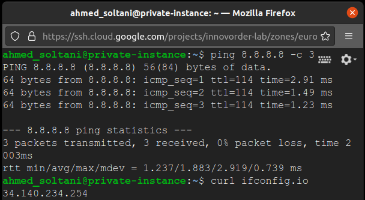

# Hands-on Nat Gateway


<p align="center">  </p>


## First Solution ( Using virtual machine to act as a NAT gateway)

<p align="center">  </p>

Create a VPC network to host your virtual machine instances for this scenario

```bash
gcloud compute networks create vpc-innovorder-lab \
	--subnet-mode=custom \
	--project=innovorder-lab
```


Create subnet for the `europe-west1` region:

```bash
gcloud compute networks subnets create vpc-innovorder-lab-subnet-europe-west1 \
	--network=vpc-innovorder-lab \
	--region=europe-west1 \
	--range=10.1.0.0/24 \
	--project=innovorder-lab 
```


Create firewall rules to allow SSH connections in the new network you just created

```bash
gcloud compute firewall-rules create vpc-innovorder-lab-allow-ssh \
	--direction=INGRESS \
	--priority=1000 \
	--network=vpc-innovorder-lab \
	--action=ALLOW \
	--rules=tcp:22 \
	--source-ranges=0.0.0.0/0 \
	--target-tags=allow-ssh \
	--project=innovorder-lab
```

Create firewall rules to allow internal communication inside the network

```bash
gcloud compute firewall-rules create vpc-innovorder-lab-allow-internal-traffic \
    --direction=INGRESS \
    --priority=1000 \
    --network=vpc-innovorder-lab \
    --action=ALLOW \
    --rules=all \
    --source-ranges=10.1.0.0/24 \
    --target-tags=allow-internal-traffic \
    --project=innovorder-lab
```


Create a virtual machine to act as a NAT gateway on `vpc-innovorder-lab`

```bash
gcloud compute instances create nat-gateway-instance --network vpc-innovorder-lab \
    --subnet=vpc-innovorder-lab-subnet-europe-west1 \
    --machine-type=e2-micro \
    --image-project=ubuntu-os-cloud \
    --image-family=ubuntu-1804-lts \
    --can-ip-forward \
    --zone=europe-west1-b \
    --tags="allow-ssh,allow-internal-traffic" \
    --project=innovorder-lab
```

Ssh to your NAT gateway instance, configure **iptables** , we can use the command `paste`  get interface name, and you must enable the **IP forwarding** using `net.ipv4.ip_forward`

```bash
sudo sysctl -w net.ipv4.ip_forward=1
sudo iptables -t nat -A POSTROUTING -o $(paste <(ip -o -br link) <(ip -o -br addr) | awk '$2=="UP" {print $1}') -j MASQUERADE
```

<p align="center">  </p>

**Or** you can use [ **does not work properly yet** ' the paste command applies to my host machine ' ] :

```bash
gcloud compute ssh --zone europe-west1-b nat-gateway-instance \
	--command "sudo sysctl -w net.ipv4.ip_forward=1 && sudo iptables -t nat -A POSTROUTING -o $(paste <(ip -o -br link) <(ip -o -				br addr) | awk '$2=="UP" {print $1}') -j MASQUERADE " \
	--project=innovorder-lab
```


Create a new virtual machine without an external IP address

```bash
gcloud compute instances create private-instance \
	--network=vpc-innovorder-lab \
    --subnet=vpc-innovorder-lab-subnet-europe-west1 \
    --machine-type=e2-micro \
    --image-project=ubuntu-os-cloud \
    --image-family=ubuntu-1804-lts \
    --no-address \
    --zone=europe-west1-b \
    --tags="instance-without-external-ip,allow-ssh,allow-internal-traffic" \
    --project=innovorder-lab
```


Create a route to send traffic destined to the internet through your gateway instance

```bash
gcloud compute routes create nat-route \
    --network=vpc-innovorder-lab \
    --destination-range=0.0.0.0/0 \
    --next-hop-instance=nat-gateway-instance \
    --next-hop-instance-zone=europe-west1-b \
    --tags=instance-without-external-ip \
    --priority=900 \
    --project=innovorder-lab
```

PS : priority must be higher than the default INTERNET gateway route which is 1000


### Demonstration of the first solution

Virtual machines created

<p align="center">  </p>

Nat Gateway ip address

<p align="center">  </p>

Private instance connectivity and ip address

<p align="center">  </p>


### To delete the resources created during the first solution

To delete the "nat-route" route run :

```bash
gcloud compute routes delete nat-route --project=innovorder-lab
```

To delete the instances "private-instance" and "nat-gateway-instance" run :

```bash
gcloud compute instances delete private-instance --project=innovorder-lab
gcloud compute instances delete nat-gateway-instance --project=innovorder-lab
```

To delete the firewall-rules "vpc-innovorder-lab-allow-internal-traffic" and "vpc-innovorder-lab-allow-ssh" run : 

```bash
gcloud compute firewall-rules delete vpc-innovorder-lab-allow-internal-traffic --project=innovorder-lab
gcloud compute firewall-rules delete vpc-innovorder-lab-allow-ssh --project=innovorder-lab
```

To delete the subnetwork "vpc-innovorder-lab-subnet-europe-west1" run :

```bash
gcloud compute networks subnets delete vpc-innovorder-lab-subnet-europe-west1  --region=europe-west1 --project=innovorder-lab
```

To delete a network with the name "vpc-innovorder-lab" run : 

```bash
gcloud compute networks delete vpc-innovorder-lab --project=innovorder-lab
```


## Second solution  (Using Cloud NAT & Cloud Router)

<p align="center">  </p>

Create a VPC network to host your virtual machine instances for this scenario

```bash
gcloud compute networks create vpc-innovorder-lab \
	--subnet-mode=custom \
	--project=innovorder-lab
```


Create subnet for the `europe-west1` region:

```bash
gcloud compute networks subnets create vpc-innovorder-lab-subnet-europe-west1 \
	--network=vpc-innovorder-lab \
	--region=europe-west1 \
	--range=10.1.0.0/24 \
	--project=innovorder-lab
```


Create firewall rules to allow SSH connections in the new network you just created

```bash
gcloud compute firewall-rules create vpc-innovorder-lab-allow-ssh \
	--direction=INGRESS \
	--priority=1000 \
	--network=vpc-innovorder-lab \
	--action=ALLOW \
	--rules=tcp:22 \
	--source-ranges=0.0.0.0/0 \
	--target-tags=allow-ssh \
	--project=innovorder-lab
```

Create a new virtual machine without an external IP address

```bash
gcloud compute instances create private-instance --network vpc-innovorder-lab \
    --subnet=vpc-innovorder-lab-subnet-europe-west1 \
    --machine-type=e2-micro \
    --image-project=ubuntu-os-cloud \
    --image-family=ubuntu-1804-lts \
    --no-address \
    --zone=europe-west1-b \
    --tags="instance-without-external-ip,allow-ssh" \
	--project=innovorder-lab
```


Create a Cloud Router

```bash
gcloud compute routers create nat-router \
	--network=vpc-innovorder-lab \
	--region=europe-west1 \
	--project=innovorder-lab
```

Create a Cloud NAT

```bash
gcloud compute routers nats create nat-1 \
	--router=nat-router \
	--auto-allocate-nat-external-ips \
	--nat-all-subnet-ip-ranges \
	--enable-logging \
	--project=innovorder-lab
```


### Demonstration of the second solution

Virtual machines created

<p align="center">  </p>

Coud NAT created

<p align="center">  </p>


Details on Nat translation request (the `curl` request)

```json
{
  "insertId": "1v5avp3g6skg5cq",
  "jsonPayload": {
    "vpc": {
      "subnetwork_name": "vpc-innovorder-lab-subnet-europe-west1",
      "vpc_name": "vpc-innovorder-lab",
      "project_id": "innovorder-lab"
    },
    "connection": {
      "nat_ip": "34.140.47.0",
      "src_port": 48678,
      "nat_port": 1024,
      "dest_port": 80,
      "protocol": 6,
      "src_ip": "10.1.0.2",
      "dest_ip": "104.21.192.109"
    },
    "endpoint": {
      "zone": "europe-west1-b",
      "project_id": "innovorder-lab",
      "region": "europe-west1",
      "vm_name": "private-instance"
    },
    "gateway_identifiers": {
      "region": "europe-west1",
      "gateway_name": "nat-1",
      "router_name": "nat-router"
    },
    "destination": {
      "geo_location": {
        "country": "usa",
        "asn": 13335,
        "continent": "America"
      }
    },
    "allocation_status": "OK"
  },
  "resource": {
    "type": "nat_gateway",
    "labels": {
      "region": "europe-west1",
      "gateway_name": "nat-1",
      "router_id": "917582447040607864",
      "project_id": "innovorder-lab"
    }
  },
  "timestamp": "2021-09-26T15:09:44.400950463Z",
  "labels": {
    "nat.googleapis.com/instance_zone": "europe-west1-b",
    "nat.googleapis.com/network_name": "vpc-innovorder-lab",
    "nat.googleapis.com/subnetwork_name": "vpc-innovorder-lab-subnet-europe-west1",
    "nat.googleapis.com/router_name": "nat-router",
    "nat.googleapis.com/instance_name": "private-instance",
    "nat.googleapis.com/nat_ip": "34.140.47.0"
  },
  "logName": "projects/innovorder-lab/logs/compute.googleapis.com%2Fnat_flows",
  "receiveTimestamp": "2021-09-26T15:09:47.831000045Z"
}
```


### To delete the resources created during the second solution

To delete the Cloud NAT "nat-1"  run:

```bash
gcloud compute routers nats delete nat-1 --router=nat-router --region=europe-west1
```

To delete the router  "nat-router"  run:

```bash
gcloud compute routers delete nat-router --project=innovorder-lab --region=europe-west1
```

To delete the instance  "private-instance"  run:

```bash
gcloud compute instances delete private-instance --project=innovorder-lab
```

To delete the firewall-rules  "vpc-innovorder-lab-allow-ssh"  run:

```bash
gcloud compute firewall-rules delete vpc-innovorder-lab-allow-ssh --project=innovorder-lab
```

To delete the subnetwork "vpc-innovorder-lab-subnet-europe-west1" run :

```bash
gcloud compute networks subnets delete vpc-innovorder-lab-subnet-europe-west1  --region=europe-west1 --project=innovorder-lab
```

To delete a network with the name "vpc-innovorder-lab" run : 

```bash
gcloud compute networks delete vpc-innovorder-lab --project=innovorder-lab
```

