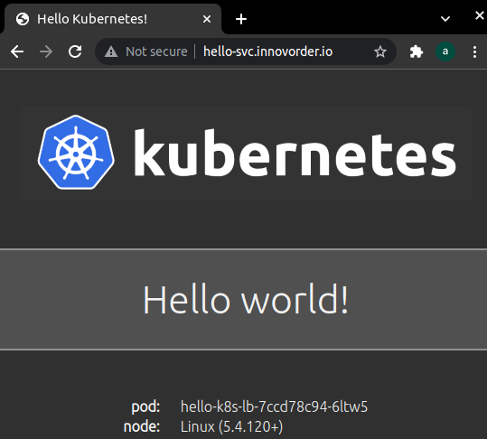

# Smoke Test

Smoke test is a series of tests to ensure your Kubernetes cluster is functioning correctly

#### Data Encryption

To verify the ability to [encrypt secret data at rest](https://kubernetes.io/docs/tasks/administer-cluster/encrypt-data/#verifying-that-data-is-encrypted).

Create a generic secret:

```shell
kubectl create secret generic test-secret --from-literal="mykey=mydata"
```

Create a pod with the secret as an environment variable and print it to the logs:

```shell
kubectl apply -f test-secret-env-pod.yaml
```

or

```shell
cat <<EOF | kubectl apply -f -
apiVersion: v1
kind: Pod
metadata:
  name: secret-env-pod
spec:
  containers:
  - name: secret-env-pod
    image: ubuntu
    env:
      - name: SECRET_MYKEY
        valueFrom:
          secretKeyRef:
            name: test-secret
            key: mykey
    command: ["printenv"]
    args: ["SECRET_MYKEY"]
  restartPolicy: Never
EOF
```

Print the logs from running the pod to see the secret:

```bash
kubectl logs secret-env-pod
```

Output

```shell
mydata
```


#### Deployments

 To verify the ability to create and manage [Deployments](https://kubernetes.io/docs/concepts/workloads/controllers/deployment/).

Create a deployment for the [nginx](https://nginx.org/en/) web server:

```shell
kubectl apply -f test-deployment.yaml
```

or

```shell
cat <<EOF | kubectl apply -f -
apiVersion: apps/v1
kind: Deployment
metadata:
  name: test-nginx
spec:
  selector:
    matchLabels:
      app: nginx
  replicas: 1
  template:
    metadata:
      labels:
        app: nginx
    spec:
      containers:
      - name: nginx
        image: nginx
        ports:
        - containerPort: 80
EOF
```

List the pod created by the nginx deployment :

```bash
kubectl get pods -l app=nginx
```


#### Port Forwarding

To will verify the ability to access applications remotely using [port forwarding](https://kubernetes.io/docs/tasks/access-application-cluster/port-forward-access-application-cluster/).

Retrieve the full name of the nginx pod:

```shell
POD_NAME=$(kubectl get pods -l app=nginx -o jsonpath="{.items[0].metadata.name}")
```

Forward port `8080` on your local machine to port `80` of the nginx pod:

```bash
kubectl port-forward $POD_NAME 8080:80
```

Output

```shell
Forwarding from 127.0.0.1:8080 -> 80
Forwarding from [::1]:8080 -> 80
```

In a new terminal make an HTTP request using the forwarding address:

```shell
curl --head http://127.0.0.1:8080
```

Output

```shell
HTTP/1.1 200 OK
Server: nginx/1.21.3
Date: Tue, 09 Nov 2021 08:35:06 GMT
Content-Type: text/html
Content-Length: 615
Last-Modified: Tue, 07 Sep 2021 15:21:03 GMT                                                         
Connection: keep-alive                                                           
ETag: "6137835f-267"                                                                     
Accept-Ranges: bytes 
```


#### Logs

To verify the ability to [retrieve container logs](https://kubernetes.io/docs/concepts/cluster-administration/logging/).

Print the nginx pod logs:

```shell
kubectl logs $POD_NAME		
```

Output

```bash
127.0.0.1 - - [09/Nov/2021:08:35:06 +0000] "HEAD / HTTP/1.1" 200 0 "-" "curl/7.68.0" "-"
```


#### Exec

to  verify the ability to [execute commands in a container](https://kubernetes.io/docs/tasks/debug-application-cluster/get-shell-running-container/#running-individual-commands-in-a-container).

Print the nginx version by executing the nginx -v command in the nginx container:

```shell
kubectl exec -ti $POD_NAME -- nginx -v
```

Output


#### Services

To verify the ability to expose applications using a [Service](https://kubernetes.io/docs/concepts/services-networking/service/).

Expose the nginx deployment using a [LoadBalancer](https://kubernetes.io/docs/concepts/services-networking/service/#loadbalancer) service:

```bash
kubectl expose deployment test-nginx --port=80 --type=LoadBalancer
```

Watch the new service until it gets an address (might take a few minutes)

```shell
kubectl get svc test-nginx --watch -o jsonpath="{.status.loadBalancer}"
```

Retrieve the external IP address of a worker instance:

```shell
EXTERNAL_IP=$(kubectl get service test-nginx -o jsonpath="{.status.loadBalancer.ingress[0].ip}")
```

Make an HTTP request using the external IP address:

```shell
curl --head http://${EXTERNAL_IP}
```

Output

```shell
HTTP/1.1 200 OK
Server: nginx/1.21.3
Date: Tue, 09 Nov 2021 14:34:48 GMT
Content-Type: text/html
Content-Length: 615
Last-Modified: Tue, 07 Sep 2021 15:21:03 GMT
Connection: keep-alive
ETag: "6137835f-267"
Accept-Ranges: bytes
```


#### External DNS

To verify if the [External DNS](https://github.com/helm/charts/tree/master/stable/external-dns) works correctly.

Create the following sample application to test that ExternalDNS works.

```shell
cat <<EOF | kubectl apply -f -
---
apiVersion: apps/v1
kind: Deployment
metadata:
  name: hello-k8s-lb
spec:
  replicas: 3
  selector:
    matchLabels:
      app: hello-k8s-lb
  template:
    metadata:
      labels:
        app: hello-k8s-lb
    spec:
      containers:
      - name: hello-kubernetes
        image: paulbouwer/hello-kubernetes:1.5
        ports:
        - containerPort: 8080
---
apiVersion: v1
kind: Service
metadata:
  name: hello-k8s-lb
  annotations:
    external-dns.alpha.kubernetes.io/hostname: hello-svc.innovorder.io
spec:
  type: LoadBalancer
  ports:
  - name: http
    port: 80
    targetPort: 8080
  selector:
    app: hello-k8s-lb
EOF
```

After roughly two minutes check that a corresponding DNS record for your service was created

```bash
gcloud dns record-sets list \
	--zone "innovorder-io-zone" \
    --name "hello-svc.innovorder.io" \
    --project=innovorder-infra
```

Output

```shell
NAME                      TYPE  TTL  DATA                       
hello-svc.innovorder.io.  A     300  ip-@
hello-svc.innovorder.io.  TXT   300  "heritage=external-dns,external-dns/owner=default,external-dns/resource=service/default/hello-k8s-lb" 
```

<p align="center">  </p>

#### Cleaning Up
To delete the compute resources created during the test

```
kubectl delete secrets test-secret
kubectl delete pod secret-env-pod
kubectl delete deployments.apps test-nginx
kubectl delete svc test-nginx
kubectl delete deployments.apps hello-k8s-lb
kubectl delete svc hello-k8s-lb
```


------

source: [link](https://github.com/jamesward/kubernetes-the-easy-way/blob/master/docs/13-smoke-test.md)
