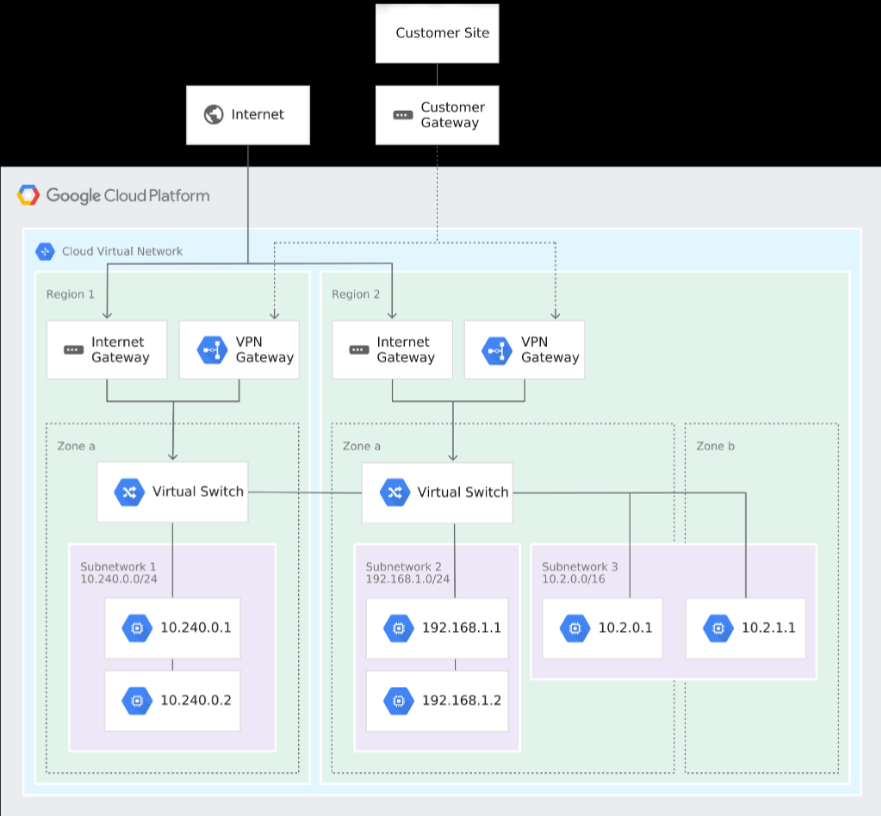

# Google Cloud Network Concepts

The Power of the Network 
* Simply put, Google has one of the most powerful and robust networking infrastructures on the planet.
*  It is necessary to support their own apps (multiple apps with 1 billion+ users each). 
*  The same network that powers Google also powers our GCP resources. 

Breaking the Network Down 
* Regions
* Zones
* Edge Points of Presence (POP) 

## Regions
* Independent geographic areas that host GCP data centers.
 * At the moment, 22 regions are available worldwide, and growing.
 * Typically consists of 3 or more Danes.
 *  Examples: us-centrall, europe-west4, asia-east2 

## Zones
* Deployment areas for GCP resources within a region. Multiple individual data center buildings in the geographical region. 
* Typically 3 or more per region. 
* Considered a "single resource failure domain." For fault tolerance, it is best to deploy applications across multiple zones (and regions, where applicable). 
* Examples: us-centrall -a, us-centrall -b, asia-east2-a 

## Edge Point of Presence (POP)
* Where Google's network connects to the rest of the Internet. • 'Interconnects with other networks"
* Over 130 exchange points exist around the world. 

Important : 
* Regions by default communicate with each other over google private network.
* Zone is considered a “single failure domain” so for fault tolerance it’s best to deploy across multiple zones.

* GCP network is global in scope, and the defauk mode of operations. 
* All traffic between regions (and within POP network) is on Google's private network 
    * i.e., a global private network (never touches the public Internet)
    * Result: better security, routing, and performance.
* GCP networking resources privately communicate all over the world by default. 

# Virtual Private Cloud (VPC)

### Big Picture Facts 
* Central foundation of all other networking functions on GCP 
* VPC = Software Defined Network (SDN) Traditional network = multiple hardware components (routers, servers, switches, load balancers, firewall devices, device configurations, etc.) Hardware management is abstracted away Removes maintenance and overhead Rapidly customize and scale services Traditional networking concepts apply 
* Firewalls, routes, load balancing, subnets, DNS, etc. 
* Global (multi-regional) communications space, private communication among resources 
    * RFC 1918 - Private (internal) networking and IP addressing standard 
    * Internal/Private IP addressing — not exposed to public Internet 
* Hybrid networking with on-premises networks that have interconnect options 
* Can configure private (internal-only) access to other GCP resources 
* Incoming (ingress) traffic is free and outgoing (egress) traffic has a cost 

### Example VPC Diagram (Hybrid Network)ing)

