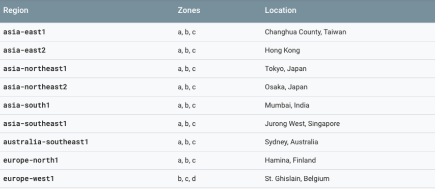
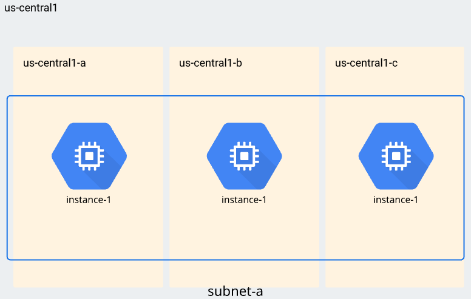
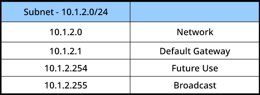
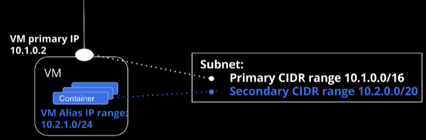
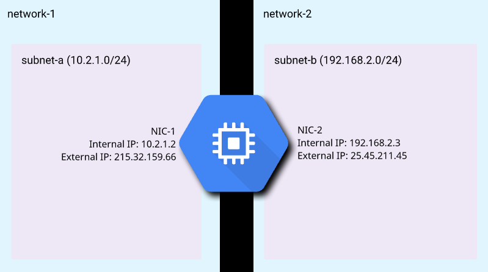
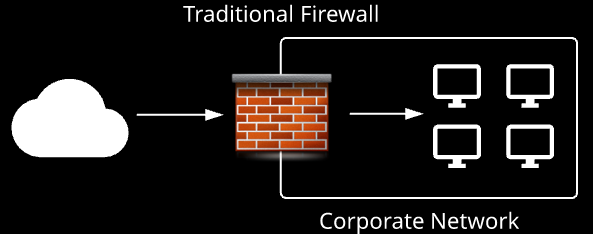
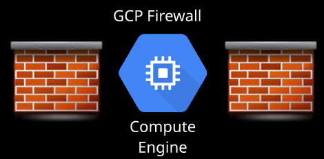
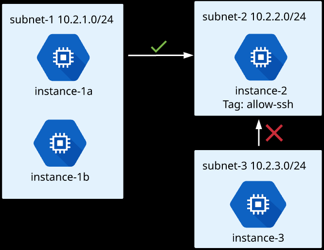

# Google Cloud Network Concepts

The Power of the Network 
* Simply put, Google has one of the most powerful and robust networking infrastructures on the planet.
*  It is necessary to support their own apps (multiple apps with 1 billion+ users each). 
*  The same network that powers Google also powers our GCP resources. 

Breaking the Network Down 
* Regions
* Zones
* Edge Points of Presence (POP) 

## Regions
* Independent geographic areas that host GCP data centers.
 * At the moment, 22 regions are available worldwide, and growing.
 * Typically consists of 3 or more Danes.
 *  Examples: us-centrall, europe-west4, asia-east2 

## Zones
* Deployment areas for GCP resources within a region. Multiple individual data center buildings in the geographical region. 
* Typically 3 or more per region. 
* Considered a "single resource failure domain." For fault tolerance, it is best to deploy applications across multiple zones (and regions, where applicable). 
* Examples: us-centrall -a, us-centrall -b, asia-east2-a 

## Edge Point of Presence (POP)
* Where Google's network connects to the rest of the Internet. • 'Interconnects with other networks"
* Over 130 exchange points exist around the world. 

Important : 
* Regions by default communicate with each other over google private network.
* Zone is considered a “single failure domain” so for fault tolerance it’s best to deploy across multiple zones.

* GCP network is global in scope, and the defauk mode of operations. 
* All traffic between regions (and within POP network) is on Google's private network 
    * i.e., a global private network (never touches the public Internet)
    * Result: better security, routing, and performance.
* GCP networking resources privately communicate all over the world by default. 

# Virtual Private Cloud (VPC)

### Big Picture Facts 
* Central foundation of all other networking functions on GCP 
* VPC = Software Defined Network (SDN) Traditional network = multiple hardware components (routers, servers, switches, load balancers, firewall devices, device configurations, etc.) Hardware management is abstracted away Removes maintenance and overhead Rapidly customize and scale services Traditional networking concepts apply 
* Firewalls, routes, load balancing, subnets, DNS, etc. 
* Global (multi-regional) communications space, private communication among resources 
    * RFC 1918 - Private (internal) networking and IP addressing standard 
    * Internal/Private IP addressing — not exposed to public Internet 
* Hybrid networking with on-premises networks that have interconnect options 
* Can configure private (internal-only) access to other GCP resources 
* Incoming (ingress) traffic is free and outgoing (egress) traffic has a cost 

### Example VPC Diagram (Hybrid Network)ing)

## VPCs and Projects

* Projects:
    * Primary resource and billing isolation construct
    * Hold one or more VPCs per project VPC exists within a single project (with shared VPCs being an exception)
    * By default, can have up to five separate VPCs per project (is increased via quota management)
*  Projects separate users, whereas VPCs separate systems 

# Subnets

## Subnets on GCP VPCs 
* VPCs do not come with an associated IP range (must create subnets) 
* Subnet = a logical network partition 
    * Private IP ranges
        * RFC 1918 private IP ranges (10.x.x.x/172.16.x.x/192.168.x.x)
    * Multiple "subnetworks" inside of a larger single network
    * Subitthl = dividing network address space to match an organization's internal network needs
    * On GCP — designated using CIDR notation for network/host division
        * Example: 'subnet-a'. 10.0.1.0/10 
* We can have more than one subnet per region, more than one zone per subnet, the same subnet in different zones.

## VPC Structure - Subnets/IP ranges 
* VPC can have one or more subnets 
* Subnet = region based 
    * Subnet can span zones in same region 

## GCP Subnet Modes 
* Default Auto Mode, Custom 
* Default = created with every new GCP Project 
    * Auto-mode network + pre-made firewall rules
* Auto Mode Network = automatically created subnet for each region
    * One subnet for every region
        * Subnet range of 10.x.x.x/20 per region
        * Get up and working quickly 
    * Can manually add additional subnets or convert to custom mode 
    * Why use auto mode
        * Easy to set up and use
        * Predefined IP ranges dont overlap with each other 
    * Why not to use auto mode 
        * Not as flexible as custom mode
        * Dont need subnet for each region
        * Connecting two different VPCs (VPN/network peering)= overlapping subnets
        * Often not suitable for production networks
* Custom Mode Network  
    * No subnets automatically created -"blank slate" 
    * Much more flexible 
    * "Build your Own Network"
* VPC mode conversions - one way only 
    * Can covert auto mode to custom mode, but not vice versa 

## Reserved IP Addresses 
* Like traditional networks, subnets have the first and last two IVs in range reserved
* First network address
* Second: default gateway
* Second to last future use address
* Last broadcast address 

## Address Ranges 
* Primary Address Ranqe  
    * Any private RFC 1918 CIDR block 
    * VM primary internal IP addresses, alias addresses, internal load balancers
* Secondary Address Rant
    * Only for alias IP ranges 
    * Useful for containers or multiple VMS on a single machine 

## Beware Overlapping Subnet Ranges! 
* Just like traditional networks, you cannot have two subnet ranges overlap
* Considerations: 
    * Subnets in same VPC 
    * Subnets in multiple peered VPCs
        * Two auto-mode VPCs cannot be peered 
    * Subnets in external, interconnected networks 
    * Larger subnet range (e.g./10 address) can conflict with smaller range subnets that fall in the same range 

## Expanding Subnets 
* If your subnet range is too small, you can expand it Expands only, cannot shrink Example: Expand from /20 to /16 subnet 

## VPC Hands On Demo
What we will cover:
* View default network
* Create auto mode network 
    * Convert to custom mode network
* Create custom mode network with custom subnets
* Expand a subnet
* Throughout demo - explore Google Cloud SDK commands 

# IP Addresses
## IP Addresses on for GCP Resources
* Every VM needs an IP address to communicate
* Must have at least one internal address, external address is optional 

## Internal Addresses - Types
* Assigned from internal DHCP pool 
    * Ephemeral remains even when stopped
* Can assign static internal address 
    * Within assigned subnet range
* Internal DNS format (FQDN): (instance.name).c.(project-id).internal 
    * Example: 'my-instance.c.test-projectAnternar 

## External Addresses - Types
* Ephemeral - temporary 
    * Assigned when resource created/running 
    * Released when stopped/deleted
* Reserved (Static) - preserved through stoppage 
    * Bound to specific region (e.g., us-centrall)
    * Billed when not attached to VM
* Fun fact VM doesn't know external IP - mapped to internal IP
* No default public DNS, need to use DNS services like Cloud DNS 

## Multiple Network Interface Controllers (NICs) 
* VM can have exactly one internal extemal IP per VPC
* VM can have multiple network interfaces (one per VPC), with one internal/external per NIC
* In other words, a single VM can be on multiple VPCs, with single internal/external address for each VPC 

## Why Multiple IPs/Interfaces?

* Instance as network appliance
    * Web intrusion/firewall
    * WAN optimization
* Application require traffic separation
    * Data plane traffic from management plane traffic

!! If you create your vm and you attached it to a vpc and later you release that you need another vpc, you must destroy it and create a new one with 2 vpcs !!

## Multiple NIC Limitations
* Must set up on instance creation
* 1 NIC per network
* Cannot overlap subnet ranges
* Cannot delete interface
* Up to 8 NICs total 
    * <= 2 CPUs 2 NICs 
    * >2 CPUs= 1 NIC per CPU (up to 8) 

## What We Will Cover
* Create an instance
    * View network settings 
    * View ephemeral external IP behavior
* Reserve an external IP address
* Create two custom VPC's and a single two NIC instance
* Command to set up two VPC environments provided in lesson description 

## Firewall Basics
* Allow/deny traffic to and from instances
    * Based on configuration
* Manage both inbound (ingress) and outbound (egress) traffic
* Defined at network (VPC) level, but enforced for each instance 

## Firewall Rules
* Rules manage external access and also access between internal resources
* Implied 'deny all' ingress
* Implied 'allow all' egress

If i don’t have any firewall in my vpc by default all ingress and egress traffic will be denied.
Egress traffic is allowed by default.

## Firewall components:

## Network Tags
* Instance-level, granular enforcement
* Apply tag to instance
* Rule is enforced on only tagged instances and not entire network

### Firewall rule:
* Allow port 22 access
* Target: network tag - 'allow-ssh'
* Source filter: 10.2.1.0/24

### Result:
* Instances in subnet-1 can SSH to instance-2, but not instance-3 outside of subnet-1

# Routing 
## Routing on GCP
* Defines paths of network traffic from a VPC resource (i.e., an instance) to other destinations
    * Each route has a single destination + sigle next hop 
    * Both within and outside of the VPC 
    * Allows VPC resources to communicate with each other
* Most GCP services automatically create system.generated  routes 
    * Created and removed for you (as needed)
* Traffic needs to match firewall rules robe delivered
* Many options similar to firewall rules
    * Priority: smaller number has a higher priority 
    * Apply to entire network or network tagged instances 

## System-Generated Routes
* Default Route
    * Default route out of your VPC to the external Internet (0.0.0.0/0) 
    * Provides pathing for Private Google Access  
    * Can be deleted to isolate VPC from Internet, or replace with custom route
* Subnet Route 
    * Define destination path for each VPC subnet ("everything finds everything") 
    * Cannot be deleted 
    * Cannot create custom routes that are more specific than subnet route destinations
        * To restrict traffic between subnet/resources, use firewall rules 

## Custom Routes - What You Create
* Static and Dynamic Routes
    * Routes you create, or get created by Cloud Router
    * Configure your own destination (next hop)

## When to Use Custom Routes
* Manually created network appliance
    * NAT Gateway, Load Balancer, Firewall
    * Per Google, consider GCP managed services instead

## Instance as "Next Hop"
* Must enable IP forwarding on instance
    * Must configure on instance creation

* Private-instance routes outbound Internet gateway traffic through nat-gateway
* Nat-gateway has IP Forwarding enabled
* Destination = 0.0.0.0/0
* Next Hop = nat-gateway
* Route applies only to "no-ip" tagged instances 
